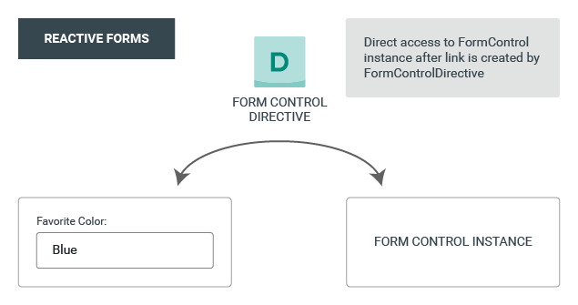

# Forms in Angular

**Reactive forms** are more robust: they're more scalable, reusable, and testable. If forms are a key part of your application, or you're already using reactive patterns for building your application, use reactive forms.

**Template-driven forms** are useful for adding a simple form to an app, such as an email list signup form. They're easy to add to an app, but they don't scale as well as reactive forms. If you have very basic form requirements and logic that can be managed solely in the template, use template-driven forms.

## Common foundation

Both reactive and template-driven forms share underlying building blocks.

* **FormControl** tracks the value and validation status of an individual form control.

* **FormGroup** tracks the same values and status for a collection of form controls.

* **FormArray** tracks the same values and status for an array of form controls.

* **ControlValueAccessor** creates a bridge between Angular FormControl instances and native DOM elements.

## Data flow in forms

Reactive and template-driven forms follow two different strategies when handling form input.

### Data flow in reactive forms
